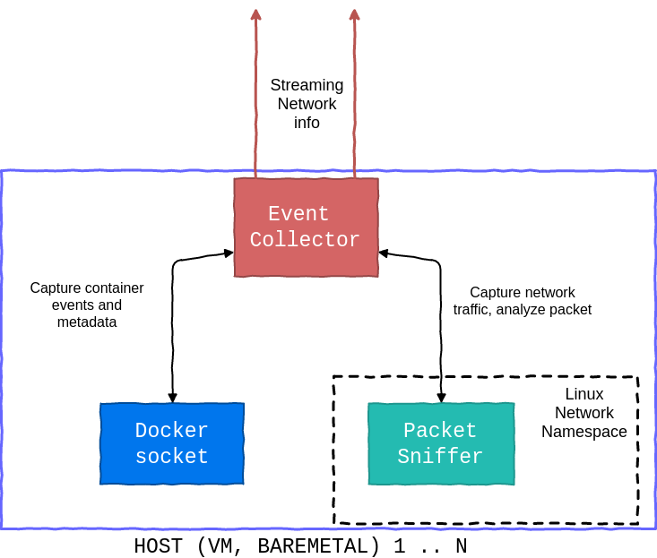

# Event collector

## Author 

Paul Boutes

## Abstract

Events collectors are agents which are deployed on
host machines. Their primary role are to collect network and
docker data, and forward them to the graph processor, in order to
generate a representation of your system, by building the container network topology.

### What type of data are collected ?

As mentioned, we collect 2 types of data:
* docker event
* network traffic

Docker events are collected in order to say: "Hey, a new container appears, let's monitor it".
Then, we collect network traffic from in-use containers.

In order to monitor our system, we need to sniff containers network traffic. As 
we want to operate as well in single host as in multi host, we can not listen to 
the `docker0` interface. We have to sniff what we called `overlay network`.
For more information, see this [issue](https://github.com/PaulBoutes/docker-event-collector/issues/6).

