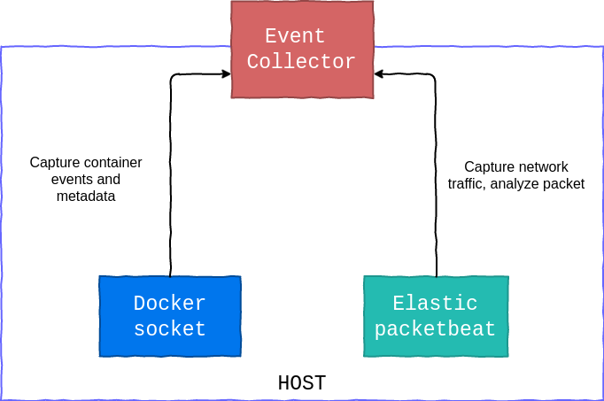

# Event collector

## Author 

Paul Boutes

## Abstract

The event collectors are agents which are deployed on
the host machines. Their primary role is to collect network and
docker data, and forward them to the graph processor, in order to
generate the representation of your system.

### What type of data are collected ?

As mentioned, we collect 2 types of data:
* docker event
* network traffic

Docker events are collected in order to say: "Hey, a new container appears, let's monitor it".
Then, we collect network traffic from in-use containers.

