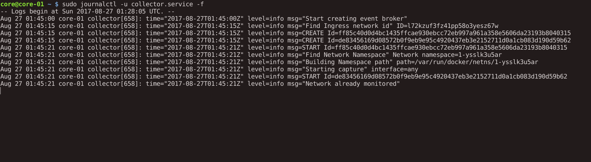
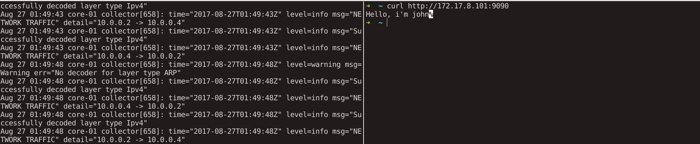

# Sample environment

## Requirements
Please, install:
- last version of [vagrant](https://www.vagrantup.com/downloads.html)
- [virtualbox](https://www.virtualbox.org/) >= 4.3.10

## Start environment

First, run the init script. This script will trigger the `vagrant up` command, create 
the swarm cluster and will start two docker services and the event-collector service:

>`./init.sh`

At the end of the script, you will be logged in the master node (core-01).
Then, you can follow the event-collector service log:
> `sudo journalctl -u collector.service -f`

Then, in your host terminal, you will be able to make a request to the client docker service,
and follow the network traffic

